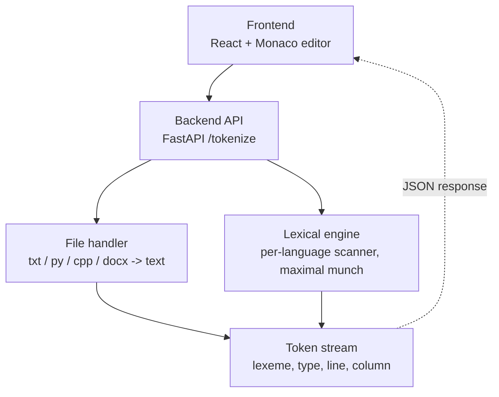

# Web-Based Lexical Analyzer

A multi-language lexical analyzer with a FastAPI backend and a zero-build
React/Monaco frontend. Paste code or upload a file (`.txt`, `.py`, `.cpp`,
`.java`, `.js`, `.docx`), and get back a table of lexemes with token type,
line, and column — for **Python, C++, Java, or JavaScript**, auto-detected
or chosen explicitly.

## Why this approach

The assignment's hidden grading set spans *multiple programming
languages*. Rather than hand-coding one grammar, the engine separates a
single, well-tested **scanner** (the algorithm) from a **language
profile** (pure data: keywords, operators, comment syntax) per language.
Adding a fifth language is a one-file change — see
`backend/app/lexer/languages/`.

## Architecture



- **Frontend** (`frontend/index.html`): a single static HTML file — React,
  Babel (in-browser JSX), and the Monaco editor, all from CDN. No build
  step. Live-highlights tokens in the editor as soon as you convert.
- **Backend** (`backend/app/main.py`): FastAPI exposing `POST /tokenize`
  (paste source) and `POST /tokenize-file` (file upload).
- **File handler** (`backend/app/file_handler.py`): extracts plain text
  from `.docx` via `python-docx`, decodes everything else defensively
  (never raises on bad bytes).
- **Lexical engine** (`backend/app/lexer/`): the scanner
  (`scanner.py`) plus one `LanguageProfile` per language
  (`languages/*_profile.py`) and an auto-detector (`detector.py`).

## Setup

### Backend

```bash
cd backend
python -m venv .venv && source .venv/bin/activate   # Windows: .venv\Scripts\activate
pip install -r requirements.txt
uvicorn app.main:app --reload
# API now running at http://127.0.0.1:8000  (docs at /docs)
```

### Frontend

No build step. Either:

- Open `frontend/index.html` directly in a browser, **or**
- Serve it (avoids any file:// quirks): `python -m http.server 5500` from
  inside `frontend/`, then visit `http://127.0.0.1:5500`.

The frontend has a **Backend URL** field (top-right of the toolbar) —
make sure it matches where uvicorn is running (default
`http://127.0.0.1:8000`).

### Tests

```bash
cd backend
pytest -v
```

35+ tests across all four languages: every required token category, line
& column tracking, maximal-munch operator disambiguation, and a dedicated
crash-resistance suite (random garbage, unterminated strings/comments,
empty input).

## Required token categories — and why there are extra ones

| Category | Required? | Notes |
|---|---|---|
| `KEYWORD`, `IDENTIFIER`, `OPERATOR`, `NUMBER`, `DELIMITER`, `ERROR` | ✅ required | All six fully implemented per language |
| `STRING`, `COMMENT` | bonus | Real code is mostly strings/comments; surfacing them (instead of discarding like whitespace) is more useful. Set `skip_comments: true` in the API to drop comments if a stricter 6-category output is wanted. |
| `PREPROCESSOR` | bonus, C++ only | `#include`/`#define` would otherwise be misclassified as `ERROR` on almost every real C++ file. See `docs/token_specification.md`. |

Full per-language rules and regex are documented in
[`docs/token_specification.md`](docs/token_specification.md) (deliverable
#2). The demo script for the video deliverable is in
[`docs/demo_script.md`](docs/demo_script.md).

## API

`POST /tokenize`
```json
{ "source": "x = 1 + 2", "language": "auto", "skip_comments": false }
```

`POST /tokenize-file` — multipart form with a `file` field, plus optional
`language` / `skip_comments` form fields.

Both return:
```json
{
  "language": "python",
  "token_count": 5,
  "error_count": 0,
  "tokens": [ { "lexeme": "x", "token_type": "IDENTIFIER", "line": 1, "column": 1 }, ... ],
  "source": "x = 1 + 2"
}
```

## Known limitations (documented, not hidden)

- Numeric literal grammar is shared across languages rather than being
  100% per-language-spec-correct (e.g. Java's `1_000L` long suffix isn't
  specially recognized as a suffix — the digits are tokenized, the
  trailing `L` becomes a separate identifier-like token).
- JavaScript template literals (`` `hello ${name}` ``) are tokenized as one
  `STRING`, not decomposed into the embedded expression.
- C-style preprocessor handling covers `#include`/`#define`-style
  directives generically; it does not evaluate macros or conditionals
  (`#ifdef`).
- Language auto-detection for pasted code (no filename) is a transparent
  keyword/syntax-marker heuristic, not a statistical classifier — it's
  very reliable on realistic code samples but can be wrong on
  deliberately ambiguous one-line snippets.

## Grading rubric mapping

| Criterion | Where to look |
|---|---|
| Tokenization accuracy | `backend/app/lexer/scanner.py` + `languages/*_profile.py`; `backend/tests/test_lexer_*.py` |
| Line & column tracking | `Lexer._advance()` in `scanner.py`; `test_line_and_column_tracking`, `test_multiline_define_with_continuation` |
| Error handling (no crashes) | Rule 11 in `scanner.py`; `backend/tests/test_never_crashes.py` |
| Frontend usability & file upload | `frontend/index.html` (Monaco editor, file upload, results table, live highlighting) |
| Report, diagram & code quality | This README, `docs/token_specification.md`, `docs/demo_script.md`, CI in `.github/workflows/tests.yml` |
